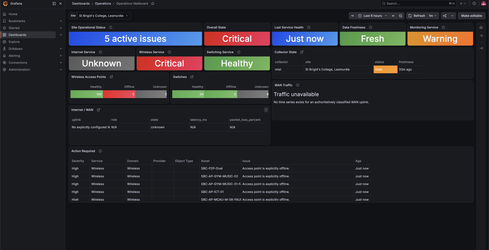
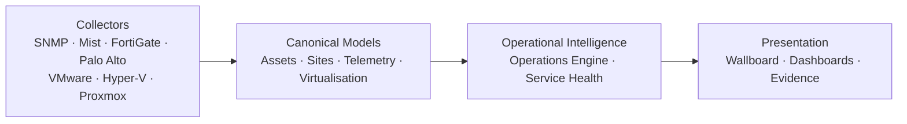
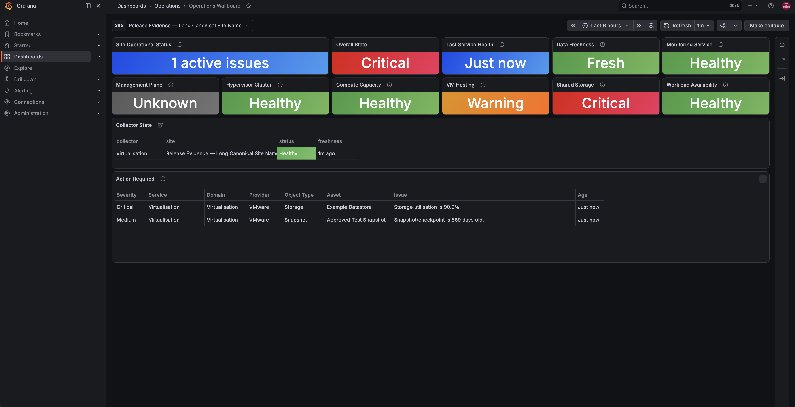
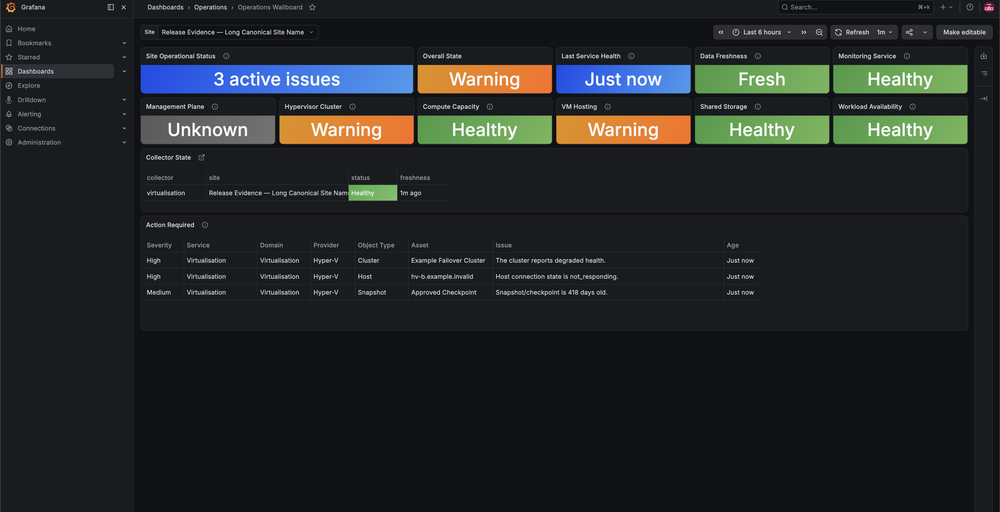
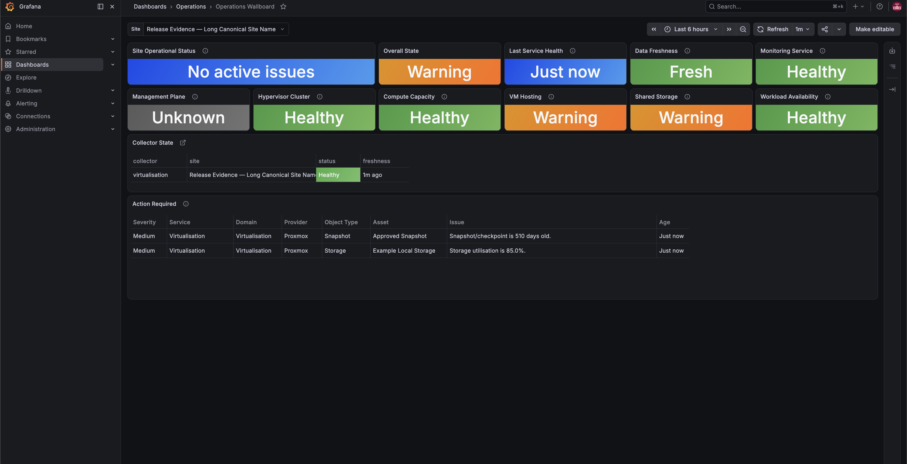

# ITP — Infrastructure Telemetry Platform

ITP is an evidence-driven infrastructure telemetry and operational intelligence
platform for multi-site organisations and managed estates.

[](docs/releases/v0.2.0-alpha.2.md)
[](https://github.com/thehallifax/itp/actions/workflows/validate.yml)




Infrastructure teams often have monitoring data split across vendor portals,
pollers, and dashboards, making it difficult to understand service impact
across a site or estate. ITP collects that evidence, resolves it into canonical
assets and services, and produces one explainable current-state operational
view without hiding vendor detail needed for investigation.

## Key capabilities

- SNMP discovery plus native Juniper Mist, FortiGate, and Palo Alto collectors
- Canonical infrastructure, inventory, site, and virtualisation models
- Deterministic Operations Engine for issues, risks, and recommendations
- Vendor-neutral Service Health with supporting assets and evidence
- Capability-aware Grafana provisioning and vendor drill-down dashboards
- Single-screen Operations Wallboard with a consolidated action queue
- Single-site, multi-site, estate, and isolated multi-customer deployment models
- Read-only VMware vSphere, Microsoft Hyper-V, and Proxmox VE intelligence
- InfluxDB 3, FlightSQL, Grafana, Telegraf, and Docker Compose deployment

ITP is Alpha software. It is intended for evaluation and controlled deployments,
not represented as production-ready.

## Architecture

Collectors own authentication, discovery, and collection. After collection,
identity, normalisation, operational rules, service evaluation, and
presentation remain deterministic and vendor-neutral.



The platform covers networking, wireless, WAN, firewalls, security, compute,
storage, printing, inventory, lifecycle, collector health, and virtualisation.
Missing or untrusted evidence produces `Unknown` rather than an invented healthy
or failed state.

See [Architecture](docs/architecture.md),
[canonical assets](docs/canonical-asset-model.md),
[Infrastructure State](docs/infrastructure-state.md), and
[canonical site identity](docs/architecture/site-hierarchy.md).

## Operational intelligence

The deterministic [Operations Engine](docs/operations-engine.md) turns
canonical evidence into Active Issues, Operational Risks, and Recommendations.
Rules use explicit evidence and thresholds—no LLMs, probabilistic scoring, or
cloud reasoning services.

[Service Health](docs/service-health.md) evaluates enabled vendor-neutral
services as `Healthy`, `Warning`, `Critical`, `Unknown`, or `Not Enabled`.
Results retain summaries, affected assets, site scope, and evidence.

The [Operations Wallboard](docs/operations-wallboard.md) presents generated
current-state service health, infrastructure counts, collector state, and a
priority-ordered Action Required queue. Vendor dashboards remain available for
engineering drill-down.

## Supported collectors

| Collector | Collection path |
| --- | --- |
| SNMP | Discovery → generated Telegraf inputs → canonical telemetry |
| Juniper Mist | Native HTTPS API → canonical network and wireless signals |
| FortiGate | Native HTTPS API → canonical firewall and interface signals |
| Palo Alto PAN-OS | Read-only XML API → canonical firewall and security signals |

Collectors ship with the repository and are enabled through configuration. A
collector owns authentication, discovery, collection, and adaptation only; it
must not contain operational or dashboard policy.

Inspect the authoritative connector catalogue without configuration or
credentials:

```sh
python -m collectors connectors list
python -m collectors connectors inspect paloalto --json
```

The [connector registry](docs/connector-registry.md) records supported domains,
deployment types, setup maturity, validation/status capabilities, secret
handling, documentation, and implementation references.

## Virtualisation

ITP normalises read-only virtualisation evidence into canonical managers,
clusters, hosts, workloads, storage, networks, and snapshots. Provider
management failure alone does not prove workload outage.

<table>
  <tr>
    <th>VMware vSphere</th>
    <th>Microsoft Hyper-V</th>
    <th>Proxmox VE</th>
  </tr>
  <tr>
    <td></td>
    <td></td>
    <td></td>
  </tr>
</table>

See [Virtualisation intelligence](docs/virtualisation.md) and the individual
[VMware](docs/collectors/vmware.md), [Hyper-V](docs/collectors/hyperv.md), and
[Proxmox](docs/collectors/proxmox.md) guides.

## Multi-site and estate support

A deployment profile is the isolation boundary for one customer or
organisation. Configuration, secrets, runtime state, Compose projects,
telemetry databases, and Grafana instances remain profile-scoped.

Within a profile, canonical site IDs support both individual-site views and an
aggregate estate view. Multiple isolated profiles can run concurrently. See
[deployment profiles](docs/deployment-profiles.md) and
[deployment models](docs/deployment-models.md).

## Getting started

Requirements: Git, Docker, and Docker Compose v2.

```sh
git clone https://github.com/thehallifax/itp.git
cd itp
./itp setup
```

The setup wizard checks Docker, Compose, and required ports; creates `.env` and
`discovery/config.yml` from tracked templates; validates the result; and can
start the platform and wait for service health. On Windows, run
`py scripts/itp.py setup`.

For unattended bootstrap:

```sh
./itp setup --non-interactive \
  --deployment-name "ITP Lab" \
  --deployment-type "Home Lab" \
  --grafana-port 3000 \
  --start
```

Existing configuration is preserved unless an interactive update is confirmed
or `--force` is supplied. Open Grafana at the URL printed by the wizard.
Datasources, folders, and enabled dashboard packs are provisioned automatically.
See the [Quick Start](docs/quick-start.md) for configuration and credential
next steps.

For a customer-scoped deployment:

```sh
./itp profile list
./itp profile init-secrets <profile>
./itp profile validate <profile>
./itp profile up <profile>
./itp profile status <profile>
```

Enable a collector by configuring its endpoint, setting `enabled: true`, and
copying only its required `.env.example` secret template to a local `.env`
file. Never commit populated secrets, root `.env`, customer evidence, or
generated runtime state.

See [Getting Started](docs/getting-started.md),
[Installation](docs/INSTALL.md), and the
[Operator Guide](docs/operator-guide.md).

## Repository layout

```text
collectors/          collector framework and vendor implementations
analysis/            canonical state, operations, services, sites and virtualisation
telemetry/           vendor-neutral telemetry contracts
dashboards/          version-controlled Grafana dashboards
grafana/             datasource and dashboard provisioning
profiles/            tracked customer deployment definitions
runtime/             generated, profile-isolated operational state
config/              site and platform configuration
discovery/           SNMP discovery and compatible configuration
scripts/             installation, update and evidence tooling
docs/                architecture, operator and collector documentation
```

## Current Alpha limitations

- Operator review is required before deployment and upgrades.
- State history is filesystem-backed and manually invoked; scheduled capture,
  retention pruning, and history queries are not yet implemented.
- Provider and infrastructure-domain coverage is incomplete.
- Optional API fields may produce `Unknown` rather than inferred health.
- Service-impact rules are deliberately conservative.
- Platform high availability is not included.
- Vendor credentials remain operator-managed and are stored only under
  `secrets/`; the bootstrap wizard does not request or copy secrets.

## Roadmap

**OPS-008 Phase 1 — State History and Change Detection** is implemented with
canonical snapshots, deterministic change sets, and atomic filesystem storage.
The next phase will add:

- scheduling after successful canonical analysis;
- bounded retention and recovery behavior;
- history query interfaces;
- state-transition evidence for operational rules.

Later work will expand relationships, lifecycle intelligence, collectors, and
service coverage without weakening the canonical vendor-neutral architecture.

See the [Alpha 2 release notes](docs/releases/v0.2.0-alpha.2.md),
[OPS-008 architecture](docs/ops-008-state-history.md), [changelog](CHANGELOG.md),
[contribution guide](CONTRIBUTING.md), and
[security policy](SECURITY.md).
