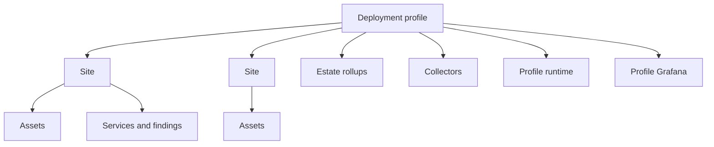

# Deployment architecture

A profile is the security and customer boundary. It owns configuration,
canonical sites, secrets, scheduling, InfluxDB storage, Grafana provisioning
and runtime outputs. `deployment_id` identifies the profile; `site_id`
partitions locations within it.

Profile outputs include `sites/hierarchy.json`, `services/estate-health.json`
and `operations/estate-state.json`. Dashboard and telemetry selection applies
the profile before site filtering. Legacy single-site configuration remains
readable, but explicit profiles are the supported workflow.

See [deployment profiles](../deployment-profiles.md) and
[site hierarchy](site-hierarchy.md).
